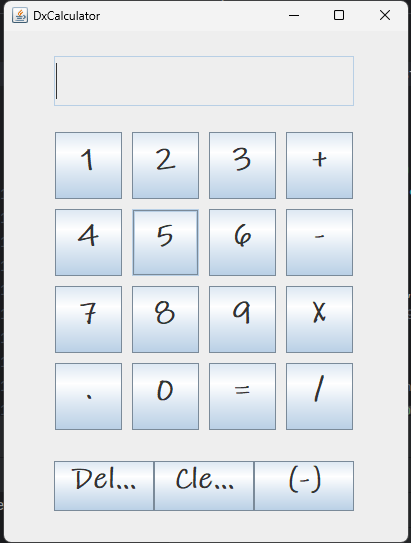

# DxCalculator
<pre>                     </pre>
The Calculator can do these operations:
<ul>
    <li>Summation</li>
    <li>Subtraction</li>
    <li>Multiplication</li>
    <li>Division</li>
    <li>Decimal Value</li>
    <li>Negation</li>
</ul>
